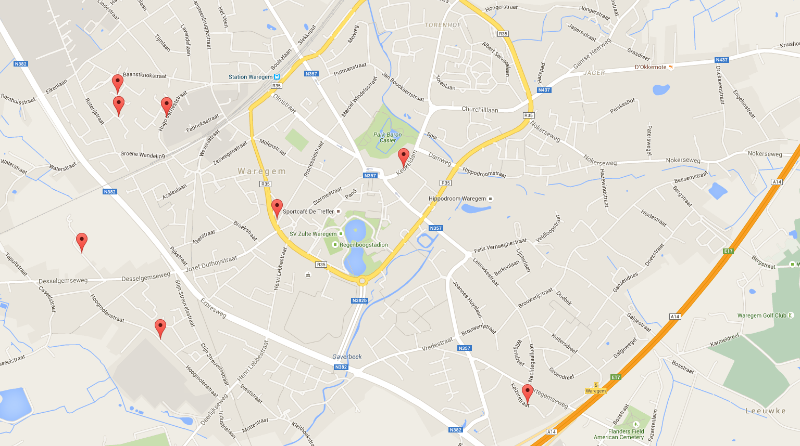

# easy-mapper

Sometimes, I just want to map some data on a map, without a lot of hassle. Usually, that data contains street names and numbers instead of latitudes and longitudes.

This repository contains two quick and dirty things that help me with that:

* `csv-to-json.py`, a script that takes in a CSV file, geocodes the addresses, and saves the resulting data to `output.json`,
* `index.html`, a file that maps the resulting JSON onto Google Maps.

Serve `index.html` and `output.json` from a webserver (e.g. `http-server`), or you may run into trouble.

You will need a Google Maps API key, see [here](https://developers.google.com/maps/documentation/javascript/get-api-key) for more information.

